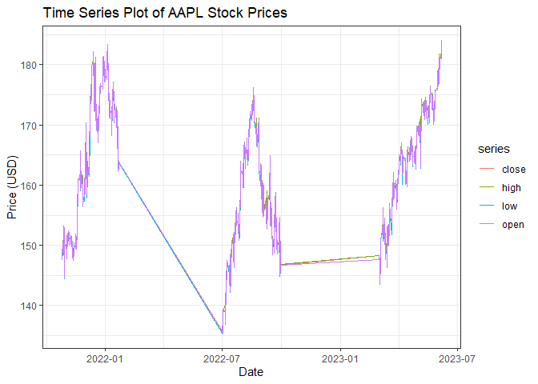
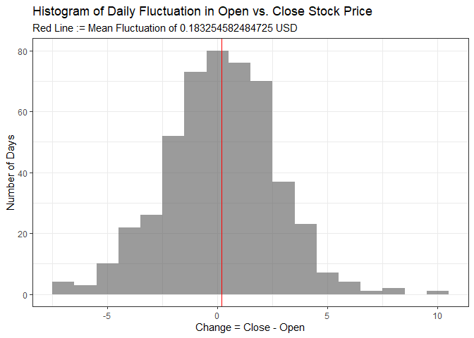

Querying the Polygon Stock API
================
Carter Hall
2023-10-08

# Package List

The following packages were used to create this vignette:

- `httr`: Essential to querying APIs in R
- `tidyverse`: The gold-standard of data manipulation, plotting, etc.
- `knitr`: Used to create the vignette!
- `jsonlite`: Parsing JSON information returned from API calls
- `ggpubr`: For a custom visualization via the `ggpaired` function

# Functions to Query API

Note that there is a function not explicitly defined in this vignette,
`process_query`, which was developed to simply convert JSON to `R` lists
and extract the dataframe of stock figures for each query.

The first function introduced in this report is extracting ticker
symbols and general company information for companies participating in
the U.S. stock market (e.g., Apple (AAPL), Google (GOOG), X/Twitter (X),
etc.).

``` r
query_tickers_stock <- function() {
  query <- GET(
    paste0(
      "https://api.polygon.io/v3/reference/tickers?market=stocks",
      "&active=true&limit=1000&apiKey=", Sys.getenv("API_KEY")
    )
  )
  
  # Use hidden function to process the query and convert
  # results to dataframe
  return(process_query(query))
}
```

Utilizing the above function, we may now query information regarding an
individual stock with the function below – **note that all times** **are
`YYYY-MM-DD`** format.

``` r
#' @title Query an Individual Stock
#' @description Retrieve figures for a stock between certain dates, at a 
#' specified interval.
#' @param stocksTicker The ticker symbol for a stock.
#' @param multiplier The number of times per `timespan` to retrieve.
#' @param timespan The interval at which figures are retrieved (e.g., 'day',
#' 'minute').
#' @param from Start date, YYYY-MM-DD format.
#' @param to End date, same format as `from`.
#' @returns Data frame of results.
query_indiv_stock <- function(stocksTicker = "AAPL",
                              multiplier = 1,
                              timespan = "day",
                              from = "2023-01-09",
                              to = "2023-02-09") {
    
  # Validate the timespan for the API query (404 error returns on 
  # other invalid queries, as per APIs)
  if (!timespan %in% c("day", "minute", "hour", "week", "month",
                       "quarter","year")) {
    warning("Stopping query -- value should be one of 
             day, minute, hour, week, month,
             quarter, year")
    stop()
  }
  
  query <- GET(
    paste0(
      "https://api.polygon.io/v2/aggs/ticker/",
      stocksTicker, "/", "range/", toString(multiplier),
      "/", timespan, "/", from, "/", to, 
      "?adjusted=true&sort=asc&limit=50000&apiKey=",
      Sys.getenv("API_KEY")
    )
  )
  
  # Use hidden function to process the query and convert
  # results to dataframe
  return(process_query(query))
}
```

We now generalize the function above to query information about the
entire stock market (or, rather, the data available to the API) for a
particular day. Note that `include_otc` includes **Over-the-Counter**
(OTC) securities, meaning financial entities that are traded without
being listed on popular exchanges.

``` r
#' @title Query Stock Market for One Day
#' @description Retrieve information about stock figures across the market for
#' a particular day.
#' @param date Date, in YYYY-MM-DD format.
#' @param include_otc Boolean value to include/exclude OTC securities.
#' @returns Data frame of results.
query_market_stock <- function(date = "2023-01-09",
                               include_otc = FALSE) {
  query <- GET(
    paste0(
      "https://api.polygon.io/v2/aggs/grouped/locale/us/market/stocks/",
      date,
      "?adjusted=true",
      ifelse(include_otc, "&include_otc=true", ""),
      "&apiKey=", Sys.getenv("API_KEY")
    )
  )
  
  # Use hidden function to process the query and convert
  # results to dataframe
  return(process_query(query))
}
```

# Exploratory Data Analysis (EDA) via API

## Disclaimer

Being data focused on stocks, the presence of categorical variables in
reference to a *particular* stock are limited, especially at a Free Tier
of the Polygon API. The question(s) of-interest are motivated through
categorical data analysis of popular exchanges on which stocks are
traded, exchanges whose histories can be accessed via the API itself.

There are categorical variables created *from* numerical figures to
answer the questions of-interest but, at a stock-specific level, the
data become highly quantitative (as is the nature of stocks). Many other
categorical variables (e.g., the tapes on which trades are
conducted/recorded) are through a more premium version of the API.

Additionally, because of the Free Plan query limits, juxtaposing
multiple stocks without having to wait *minutes upon minutes* for limits
to expire and for new querys to be submitted, is also intractable;
hence, this EDA focusing on one stock.

## Background

**Stocks** are numerical figures that encode the overall net worth of a
company based on its *price per share* – as a **share** is analogous to
a small piece of a pie that is a publicly traded company, the more that
piece is worth, so too is the company to which it belongs! From a
statistical perspective, we might consider stocks **time series** –
statistical data that is best modeled with the consideration of a
temporal component as a ‘predictor’, rather than a variable $Y$ as a
function of independent (or co-linear) predictors $\mathbf{X}$.

Predictive modeling stock prices is a challenge best reserved for the
financial industry, as the leading perception of such figures is that
effective modeling is difficult to achieve due to **Brownian motion**, a
physics/chemistry concept generalized to refer to numerical entities
whose movements or fluctuations are best characterized by randomness
(e.g., a [Wiener process](https://en.wikipedia.org/wiki/Wiener_process)
with small perturbations sampled from a $N(0,\sigma^2)$ distribution).

As such, this EDA will instead focus on ‘answering’ a different type of
question – **how volatile are stock prices, really?** More generally,
this EDA will focus on the general fluctuations that are seen with stock
prices, particularly *Apple* stock prices – the a tech giant is known
for their frequent release of new smartphones, most recently the
[**iPhone 15
Pro**](%22https://www.yahoo.com/lifestyle/iphone-15-pro-max-review-124438821.html?guccounter=1&guce_referrer=aHR0cHM6Ly9kdWNrZHVja2dvLmNvbS8&guce_referrer_sig=AQAAACNDRXjd6YeyIARqA9veCgQCC-l5zKZJdcLP0wLjSEB0HMPntZ4fHnGJaGHRTBAvf2r32p3F6793V445VzOVc_DcC5_nmaiJ2DVy0eqlqt3Cb37XDbCXcE9byElN801DwqCmZ_WLCAN6lf8RT-KfEhYc05AmGdvdaU3pADRKf5dS%22).

In answering these questions, we build the foundation for our
conclusions from the functions above that leverage the [Polygon
API](https://polygon.io/), a free API for obtaining stock data.

## Initial Investigation

Before diving into Apple stock data, let us learn more about the
different stocks whose data may be retrieved by the API. The API limits
to retrieving $1000$ observations in the function call below. We create
contingency tables as follows:

``` r
stocks <- query_tickers_stock()
table(stocks$type)
```

    ## 
    ##    ADRC      CS     ETF     ETN     ETS     ETV    FUND     PFD   RIGHT      SP 
    ##      44     568     141       5      11       1      17      67      11      17 
    ##    UNIT WARRANT 
    ##      40      78

``` r
table(stocks$primary_exchange)
```

    ## 
    ## ARCX BATS XASE XNAS XNYS 
    ##  103   29   42  517  309

``` r
table(stocks$type, stocks$primary_exchange)
```

    ##          
    ##           ARCX BATS XASE XNAS XNYS
    ##   ADRC       0    0    1   28   15
    ##   CS         0    0   29  352  187
    ##   ETF       92   29    0   20    0
    ##   ETN        5    0    0    0    0
    ##   ETS        5    0    0    6    0
    ##   ETV        1    0    0    0    0
    ##   FUND       0    0    1    0   16
    ##   PFD        0    0    1    8   58
    ##   RIGHT      0    0    0   11    0
    ##   SP         0    0    0    0   17
    ##   UNIT       0    0    4   31    5
    ##   WARRANT    0    0    6   61   11

Note that we can glean a lot of information about the stocks from this
data, namely:

1.  **The majority of stocks in this API call are Common Stocks, CS.**
    Other major groups include Exchange-Traded Funds (ETFs) and
    Warrants, the latter of which allows users to buy specified stocks
    at a particular time frame.
2.  **The second contingency table indicates that the majority of stocks
    in the call are traded on the exchange (the `X` prefix) of either
    NASDAQ (NAS) or New York Stock Exchange (NYS).** This includes many
    Fortune 500 companies, and others on the S&P 500 index (e.g., AAPL).
3.  As expected, many of the stocks traded on these two major exchanges
    are *CS*, common stocks. This is evidenced by the third contingency
    table.

These contingency tables, while not necessarily describing the Apple
data *directly*, imply that stocks traded on popular exchanges might
belong to larger, more recognizable companies! For example, the NYS\[E\]
is an incredibly famous stock exchange (… Wall Street, anyone?), and
with how pop culture depicts the investment banking industry, one could
reasonably surmise that stocks are *incredibly* volatile and are
emblematic of an entire nation’s economy (e.g., 2008).

## Apple Data

Let us first obtain stock data over the last two years for Apple; this
will be referenced by the `R` object `aapl_data`. Note that the default
parameters for this function are for the `AAPL` stock ticker, and so the
only information specified are the dates.

Note that the times given in the `t` column are Unix Msec times, meaning
the number of **milliseconds** since the beginning of 1970.

``` r
dates <- c("2021-10-01", "2022-03-01",
           "2022-07-01", 
           "2022-11-01",  "2023-03-01",
           "2023-07-01", 
           "2023-10-07")
for (i in seq(1, length(dates), 2)) {
  if (i == 1) {
    aapl_data <- query_indiv_stock(timespan = "minute", 
                               from = dates[i],
                               to = dates[i+1]) 
  }
  
  if (i != length(dates)) {
    aapl_data <- rbind(aapl_data,
                       query_indiv_stock(timespan = "minute", 
                               from = dates[i],
                               to = dates[i+1]))
  }
}
aapl_data <- aapl_data %>% mutate(
                                 t = as.POSIXct(
                                   x = t / 1000, tz = "UTC",
                                   origin = "1970-01-01"
                                 )
                               )
head(aapl_data)
```

    ##      v       vw      o      c      h      l                   t  n
    ## 1 2246 142.2284 142.05 142.30 142.46 142.05 2021-10-11 08:00:00 94
    ## 2  555 142.2837 142.32 142.32 142.32 142.32 2021-10-11 08:02:00 10
    ## 3 1777 142.4410 142.49 142.40 142.49 142.40 2021-10-11 08:04:00 64
    ## 4 1479 142.3576 142.40 142.34 142.40 142.34 2021-10-11 08:06:00 21
    ## 5  920 142.3067 142.30 142.30 142.32 142.30 2021-10-11 08:07:00  9
    ## 6  521 142.2155 142.21 142.21 142.21 142.21 2021-10-11 08:08:00 13

We now plot the different series below. **Due to a maximal number of API
calls per minute and a maximum limit on the datapoints returned by each
API call, there may appear to be ‘lapses’ in the data. This can be
solved by integrating waiting times into the API calls.**

``` r
aapl_data_pivot <- aapl_data %>% select(c, o, h, l, t) %>% rename("close" = "c",
                                            "open" = "o",
                                            "high" = "h",
                                            "low" = "l",
                                            "date" = "t") %>% pivot_longer(
                                              cols = c("close", "open",
                                                       "high", "low"),
                                              names_to = "series"
                                            ) 
aapl_data_pivot %>% ggplot() + geom_line( aes(x = date, y = value,
                                                  color = series)
                                            ) + theme_bw() + 
  labs(title = "Time Series Plot of AAPL Stock Prices",
       y = "Price (USD)", x = "Date")
```

<!-- -->

We see, at a high level, that Apple stocks are somewhat volatile over
the almost-two-year historical data obtained with the Free Plan of the
API; however, this is arguably true for just about any stock – as
investors, markets, and many industries watch day-to-day fluctuations, a
more granular flavor of analysis might offer greater insight into *why*
one would watch the market daily.

Alternatively, a more intuitive visualization might be through faceting
the different series into their own plots.

``` r
ggplot(aapl_data_pivot) + geom_histogram(aes(value), binwidth = 0.5) +
   facet_wrap(~series) + geom_vline(
     data = data.frame(xints = c(mean(aapl_data_pivot$value[aapl_data_pivot$series == "close"]),
  mean(aapl_data_pivot$value[aapl_data_pivot$series == "high"]),
  mean(aapl_data_pivot$value[aapl_data_pivot$series == "low"]),
  mean(aapl_data_pivot$value[aapl_data_pivot$series == "open"]))),
     aes(xintercept = xints), color = "red"
   ) + 
  labs(x = "Price", y = "Number of Observations", title = "Histogram of Per-Minute AAPL Stock Prices", subtitle = "Red Lines are Averages Per Facet (All around $157 USD)") + theme_bw()
```

<!-- -->

There, aesthetically, is not much difference between the price
histograms above – this makes sense, as the variables are *highly*
correlated with one another (e.g., they positively/negatively impact one
another). This is best corroborated with the correlation matrix below

``` r
cor(aapl_data %>% select(-t, -n, -v, -vw))
```

    ##           o         c         h         l
    ## o 1.0000000 0.9999637 0.9999620 0.9999647
    ## c 0.9999637 1.0000000 0.9999618 0.9999675
    ## h 0.9999620 0.9999618 1.0000000 0.9999217
    ## l 0.9999647 0.9999675 0.9999217 1.0000000

Additionally, of interest might be the *open* and *close* prices, which
can be thought of as pairs of datapoints – we might visualize the
classes of series as ‘categorical’ variables for which we can plot
pairwise relationships. We do this for *daily* prices, as per-minute
datapoints create too high a volume to be effectively visualized. (This
is the ‘new’ visualization not covered during ST 558 lectures.)

**Because the plot would look unprintable for all points, we plot a
subset of the first *100* of them.**

``` r
# Query daily stock data
aapl_data_twoyrday <- query_indiv_stock(timespan = "day", 
                               from = "2021-10-01",
                               to = "2023-10-07")

ggpaired(
  data = aapl_data_twoyrday[1:100,] %>% select(c, o) %>% 
    rename("close" = "c","open" = "o") %>% mutate(
      higher = open > close
    ),
  cond1 = "open",
  cond2 = "close",
  color = "grey",
  line.color = "higher",
  line.size = 0.4,
  palette = c("red","black"),
  linetype = "solid"
) + labs(x = "Series", y = "Price (USD)", title = "Paired Plot of Open vs. Close Prices per Day for APPL Stock")
```

<!-- -->

While this plot still contains a high volume of information, the lack of
a clear majority of black/red (black and red are financial indicators –
black is reserved for positive values, and red negative values) lines
indicates that the AAPL ticker is somewhat volatile, and a general trend
cannot be discerned from this plot alone. This is reinforced in the
below one-way contingency table.

``` r
table(aapl_data_twoyrday$c > aapl_data_twoyrday$o)
```

    ## 
    ## FALSE  TRUE 
    ##   224   277

Alternatively, we might be interested in evaluating the magnitude of
these daily share-price increases – we create a variable `change`
relating the daily change in share price (the difference between `open`
and `close`). We do the same for juxtaposing `high` versus `low` with
the variable `extreme_change`.

``` r
daily_with_change <- aapl_data_twoyrday %>% select(c, o, h, l) %>% 
    rename("close" = "c","open" = "o",
           "high" = "h", "low" = "l") %>% mutate(
      change = close - open,
      extreme_change = high - low,
      higher = close > open
    )
```

``` r
ggplot(data = daily_with_change) + geom_histogram(aes(x = change),
                                                  binwidth = 1,alpha = 0.6) + 
  geom_vline(aes(xintercept = mean(change)), color = "red") +
  labs(x = "Change = Close - Open", y = "Number of Days", 
       title = "Histogram of Daily Fluctuation in Open vs. Close Stock Price",
       subtitle = paste0("Red Line := Mean Fluctuation of ", 
                         toString(mean(daily_with_change$change)), " USD")) + 
  theme_bw()
```

<!-- -->

``` r
ggplot(data = daily_with_change) + geom_histogram(aes(x = extreme_change),
                                                  binwidth = 1,alpha = 0.6) + 
  geom_vline(aes(xintercept = mean(extreme_change)), color = "red") +
  labs(x = "Extreme Change := High - Low", y = "Number of Days", 
       title = "Histogram of Daily Fluctuation in Low vs. High Stock Price",
       subtitle = paste0("Red Line := Mean Fluctuation of ", 
                         toString(mean(daily_with_change$extreme_change)), " USD")) + theme_bw()
```

<!-- -->

We might especially be interested in summarizing the magnitude of these
increases and decreases on days in which the close price exceeded/did
not exceed the opening price. We can modify the first histogram above
via faceting to achieve such visualization:

``` r
daily_with_change <- daily_with_change %>% mutate(
  higher_mean = ifelse(higher, mean(abs(change[daily_with_change$higher])),
                               mean(abs(change[!daily_with_change$higher]))))

ggplot(data = daily_with_change) + geom_histogram(aes(x = abs(change)), binwidth = 0.5,alpha = 0.6) +
  facet_wrap(~higher) + geom_vline(aes(xintercept = higher_mean), color = "red") + labs(x = "Change = Close - Open", y = "Number of Days", 
       title = "Histogram of Daily Fluctuation in Open vs. Close Stock Price",
       subtitle = paste0("Red Line := Mean Magnitude of ",                          toString(
         round(unique(daily_with_change$higher_mean[daily_with_change$higher]),2)
  ), " USD if Close <= Open, ",
  toString(
    round(unique(daily_with_change$higher_mean[!daily_with_change$higher]),2)), 
  " USD if Close > Open")) + 
  theme_bw()
```

<!-- -->

The above plots reinforce the notion that, while the stock price is more
volatile **within** the day (as evidenced by the second histogram), the
change between close and open prices is minuscule, per share, on
average. However, the average magnitude of price change is around
$\$1.90$ per share, and is *not markedly different on days in which the
price decreased or increased, on average!* The last plot shows similar
histograms conditional on the `higher := close > open` variable, in
support of this statement.

# Conclusion

From this EDA, we see that the Polygon API can extract informative stock
price data – it should be noted that the API capabilities extend beyond
the stock market, into things such as Options and Crypto! The EDA itself
results in the central conclusion that **stock prices are more volatile
within a day, as opposed to across multiple days** – this is what makes
investing difficult, especially for people such as day traders! This is
not to say that the stock prices remain relatively constant throughout
days, weeks, and quarters (this claim would be refuted by the first plot
shown), but instead to highlight that making timely trades is, as a
consequence of both randomness and human nature, *difficult* – does a
sudden fluctuation mean a stock price is about to rapidly increase,
implying one should not yet sell? These types of questions are what many
investing industries seek to answer, and what many mathematical results
(e.g., Brownian motion, Navier-Stokes) seek to highlight.

The general trends, while evident over yearlong periods of data, are
difficult to take advantage of on a day-to-day basis, making the concept
of investing ever more complicated (there *are* multiple large
industries centered around the practice). More intuitive analysis is
left for time series modeling, but the general consensus regarding APPL
stock prices is that the stock has decreased over the past
year-and-a-half, even admist continual releases of new devices! Much of
this, of course, centers on the ever increasing price, the debacle in
European markets over USB-C charging (and American investors’ general
nervousness about the company), and, more recently, with controversy
surrounding the durability of the titanium-clad iPhone 15.
